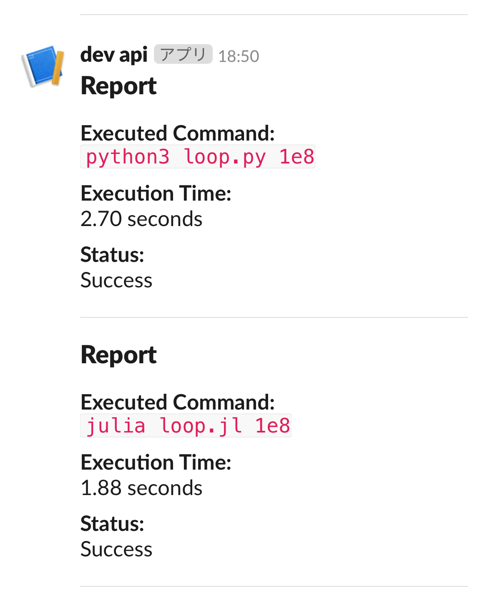

# Process completion notification bot (Sapi)

## Overview

- スクリプトの実行完了を Slack に通知する Bot

## Setup

- [Clone this repository](#clone-this-repository)
- [Create New APP](#create-new-app)
- [A. Setup automatically](#a-setup-automatically) か [B. Setup manually](#b-setup-manually) のどちらかでセットアップする

### Clone this repository

```bash
git clone https://github.com/rice8y/sapi.git
```

### Create New App

1. [Slack](https://slack.com/intl/ja-jp/signin#/signin) にログインし, Workspace を作成する.

2. [Slack API](https://api.slack.com/apps?new_app=1) にアクセスして, `Create New App` > `From a manifest` を選択する.

3. Workspace を選択する.
   
4. `manifest.yaml` を貼り付ける. この際, `api name` は適宜変更すること.

5. `Create` を選択する.

### A. Setup automatically

>[!WARNING]
>`.setup.sh` で行っていることは, [B. Setup manually](#b-setup-manually) と同様 (`api.py`, `.env` を `~/scripts` 配下に配置している).

1. `setup.sh` に実行権限を付与する.

```bash
chmod +x setup.sh
```

2. 作成した Slack アプリのトークン (`SLACK_BOT_TOKEN`), ユーザ ID (`SLACK_USER_ID`), チャンネル (`SLACK_CHANNEL`) を指定して `setup.sh` を実行する. なお, オプション引数としてシンボリックリンクの名前を指定する `--SYMLINK_NAME` が存在し, デフォルトでは `sapi` がセットされる.

```bash
./setup.sh --SYMLINK_NAME=hoge --SLACK_BOT_TOKEN=abcd-0123456789012-0123456789012-qwertyuiopasdfghjklzxcvb --SLACK_USER_ID=U0123456789 --SLACK_CHANNEL=#random
```

### B. Setup manually

#### Configuration settings

1. `api.py` を任意のディレクトリに配置する.

2. `.env` を作成する. `.env.sample` を使用する場合は, 適宜値を変更し, ファイル名を `.env` とすること.

3. `api.py` の10行目 `load_dotenv("/path/to/.env")` を正しいパスに変更する. また, 必要に応じて通知の送信先を変更する.

>[!NOTE]
>チャンネルに通知を送信する場合は, チャンネルにアプリを招待 (`/invite`) すること.

4. 依存関係をインストールする.

```bash
pip install -r requirements.txt
```

#### Create a symbolic link

1. `~/.local/bin` を作成する.

```bash
[ ! -d ~/.local/bin ] && mkdir -p ~/.local/bin
```

2. PATH に `~/.local/bin` を追加する.

>[!NOTE]
>使用している Shell に合わせて適宜変更すること.

```bash
echo 'export PATH="$HOME/.local/bin:$PATH"' >> ~/.bashrc
```

1. `.bashrc` を再読み込みする.

```bash
source ~/.bashrc
```

4. `api.py` に実行権限を付与する.

```bash
chmod +x /path/to/api.py
```

5. シンボリックリンクを作成する.

```bash
ln -s /path/to/api.py ~/.local/bin/symlink_name
```

## Usage

```bash
symlink_name <command>
```

## Example

>[!WARNING]
>以下では例として, `symlink_name` を `sapi` と設定している.

```bash
sapi python3 loop.py 1e8
```

```bash
sapi julia loop.jl 1e8
```

<div style="text-align: center;">
    
</div>

## ToDo

- Slack側のUIを見やすいように整形する
- エラー処理を追加する

## Lisence

This project is licensed under the MIT License, see the [LICENSE](LICENSE) file for details.
